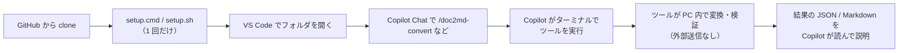

# 業務で AI（GitHub Copilot）と一緒に使うときの考え方

## 基本方針: 「GitHub に置く → clone する → Copilot から呼ぶ」

このツール群は、**MCP サーバーなどの追加の仕組みを使わず**、次の形で使うことを前提にしています。

| 選択 | 理由 |
|---|---|
| **clone + CLI + プロンプトファイル（採用）** | 追加の設定・常駐プロセスが不要。Copilot は普段どおりターミナルでコマンドを実行するだけ。ツールは Copilot が無くても単体で使える |
| MCP サーバー（今は見送り） | Copilot がツールを自動で見つけられる利点はあるが、MCP の有効化・設定ファイル・組織のポリシー確認が必要で、初心者の最初の一歩が重くなる。各 CLI は JSON 出力と終了コードがそろっているので、必要になれば薄いラッパーを後から追加できる |

## ツール自体のデータの扱い

- `doc2md` / `fieldcheck` は **PC の中だけで動きます**。ネットワークに接続せず、生成 AI の API も呼びません。
- 使う外部ツール（LibreOffice・Tesseract・draw.io）もすべてローカルで動作する無料ソフトです。
- 一時ファイルは作成者だけが読めるフォルダに作り、処理後に必ず削除します。ログに本文は出しません。

## Copilot に渡るもの

Copilot（生成 AI）には、**チャットに書いた内容、開いているファイル、Copilot が読んだファイル・コマンド結果** が送られます。

| やること | 理由 |
|---|---|
| 元の文書を直接開かせず、`doc2md` の結果を読ませる | 必要な部分だけを扱える。バイナリを誤読しない |
| 検証は `fieldcheck` に任せ、Copilot には **指摘のあった行だけ** を説明させる | データ全体をチャットに流さない |
| `out/`（変換結果）はコミットしない（各リポの `.gitignore` 済み） | 機密文書のテキスト版が GitHub に上がるのを防ぐ |
| 実データではなく `samples/` の架空データで試してから使う | ツールと手順の確認に実データを使わない |

## 組織で導入するときの確認事項（管理者向け）

- **Copilot の利用条件**: 組織の契約（Copilot Business / Enterprise など）と、社内の AI 利用規程で、
  業務文書の内容を Copilot に渡してよい範囲を確認してください。
- **コンテンツの除外**: Copilot には、組織の管理者が特定のファイルを Copilot の対象外にする設定があります
  （対象となる機能や範囲は GitHub のドキュメントで最新情報を確認してください）。
  機密文書を置くフォルダや `out/` を除外しておくと安全です。
- **リポジトリの公開範囲**: ツール群は組織内限定（private / internal）で運用し、samples には架空データだけを置きます。
- **ライセンス**: 各リポの LICENSE と、依存ライブラリのライセンスを確認してください（検討中の事項は README 参照）。

## 困ったとき

| 症状 | 対処 |
|---|---|
| `/` を入力してもプロンプトが出ない | VS Code と GitHub Copilot 拡張を最新にし、ツールのフォルダ（`.github/prompts` がある場所）を開く |
| `doc2md` が見つからない | `setup.cmd`（Windows）/ `./setup.sh` を実行。ターミナルを開き直す |
| 「LibreOffice が見つかりません」 | 無料でインストール可能。入れた場所が標準と違う場合は環境変数 `DEVTOOLS_SOFFICE` に soffice のパスを設定 |
| スキャン PDF が読めない | Tesseract（無料）と日本語データをインストール。`doc2md --check-env` で確認 |
