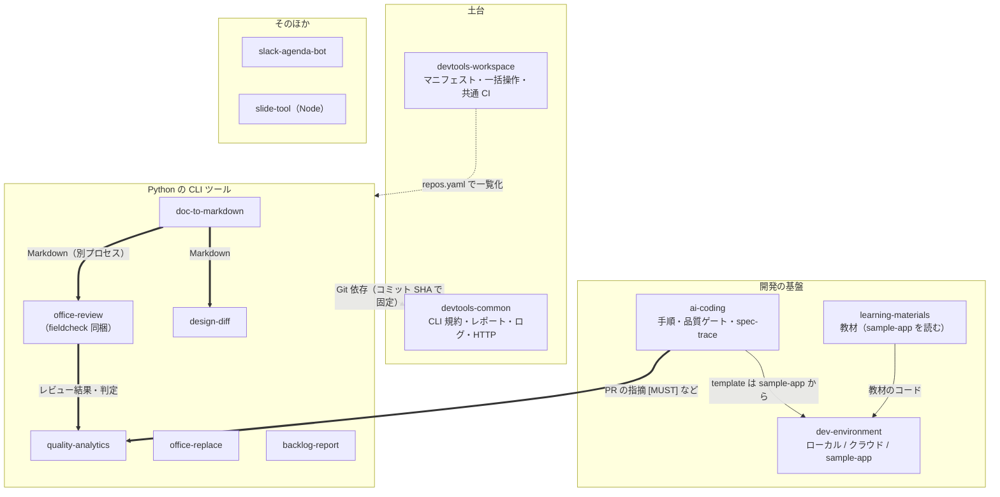

# アーキテクチャ（マルチレポ設計）

## 方針: 1 ツール = 1 リポジトリ

各ツールは独立したリポジトリで、README・CI・依存・リリース・権限をそれぞれ持ちます。

| 種類 | リポジトリ | 変更の頻度 | 版の固定方法 |
|---|---|---|---|
| 土台 | `devtools-common` | 中 | 各ツールがコミット SHA で固定して依存 |
| 土台 | `devtools-workspace` | 中 | マニフェスト（`repos.yaml`）・bootstrap・VS Code ワークスペース・パイプライン例・再利用ワークフロー |
| 開発の基盤 | `dev-environment` / `ai-coding` / `learning-materials` | 中 | main（実案件では会社の GitHub に複製して合わせる） |
| ツール | doc-to-markdown ほか 6 個 | 高 | 利用者は clone（main）または `pipx install …@<SHA>` |
| そのほか | slack-agenda-bot / slide-tool | 中 | main |

統合・廃止したリポジトリ: field-validation（office-review に同梱）、spec-trace（ai-coding の `tools/spec-trace` に同梱）、
devtools-template（[NEW_TOOL.md](NEW_TOOL.md) の手順に置き換え）、`.github`（各リポに必要なファイルを置く）、ai-prompt-kb（プロンプトは各リポの実物に）。

## 共通化のやり方（フォルダ共有はしない）

| 共通化したいもの | 方法 |
|---|---|
| 処理（CLI 規約・レポート・ログ・一時ファイル・外部 API） | `devtools-common` を各ツールが Git 依存（コミット SHA 固定）で取り込む |
| CI（lint / test / SAST / 依存脆弱性） | `devtools-workspace` の再利用ワークフローを `uses: shoyo-maya-bot/devtools-workspace/.github/workflows/python-ci.yml@<SHA>` で呼ぶ |
| lint / format 設定 | 各リポの `pyproject.toml`（`[tool.ruff]`、line-length 120〜140、Python 3.12） |
| 依存の追随 | 各リポの Dependabot（pip・github-actions） |

## 外部 API 連携の共通化

外部 API を呼ぶツールは `devtools_common.httpclient.HttpClient` を使います。

- レート制限（トークンバケット）、429 / 5xx / ネットワークエラーの指数バックオフ（`Retry-After` 優先）
- 認証情報は環境変数（`.env`、コミットしない）から `devtools_common.config.require_env()` で取得
- 本文をログに出さない（`devtools_common.log`）

## ツール間の連携

ツール同士は **別プロセス** で繋ぎ、ファイル（Markdown / JSON）を受け渡します。

- 各ツールは単体で利用・テストできる（責務を混ぜない）
- 終了コード（0 / 1 / 2 / 3）とレポートの JSON 形式は全ツール共通（`devtools_common.cli` / `report`）
- 例: `doc2md` の Markdown の表 → `fieldcheck --table <見出し>`（[examples/](../examples/)）
- 例: office-review のレビュー結果 → `qa collect office-review`（quality-analytics）

## 選定メモ（判断基準）

| マルチレポが向く | モノレポが向く |
|---|---|
| 権限・公開範囲・リリースサイクル・所有チームがツールごとに異なる | 少人数で横断変更が多い |
| 言語がバラバラ | 共通コード比率が高い |
| セキュリティ境界を分けたい（← **今回の前提**） | まとめて管理したい |

モノレポにする場合は `tools/<name>/` 構成 + パス変更検知で、ツール単位の独立 CI にします。

## ローカル開発

親フォルダに兄弟として clone し（`scripts/bootstrap.py clone`）、1 つの仮想環境に editable で入れます
（`scripts/bootstrap.py install`）。このとき各ツールの Git タグ依存 `devtools-common @ git+…` は
ローカルの `devtools-common` で置き換わるため、共有ライブラリとツールを同時に変更して試せます。

## 版の固定はタグではなくコミット SHA

共有ライブラリと共通 CI は、タグ（`v0.2.0` など）ではなく **コミット SHA** で固定して参照します。
タグは後から付け替えられますが SHA は変えられないため、同じ SHA なら必ず同じ中身になります（GitHub も Actions の参照は SHA 固定を推奨）。
更新するときは、参照先の新しい SHA に書き換える PR を出します。リリースの目印としてのタグは任意です。
