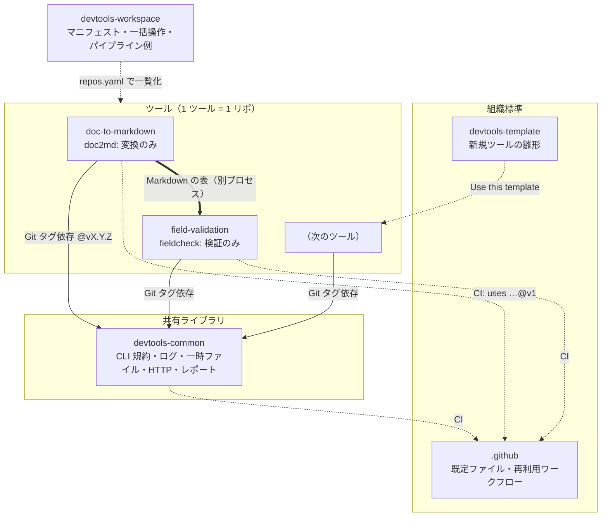

# アーキテクチャ（マルチレポ設計）

## 方針: 1 ツール = 1 リポジトリ

各ツールは独立したリポジトリで、README・CI・依存・リリース・権限をそれぞれ持ちます。

| リポジトリ | 役割 | 変更の頻度 | 版の固定方法 |
|---|---|---|---|
| `.github` | 組織既定の CONTRIBUTING / SECURITY / PR・Issue テンプレート、再利用ワークフロー | 低 | `@v1`（メジャータグ） |
| `devtools-template` | 新規ツールの雛形。lint 設定・CI 呼び出し・ディレクトリ構成の標準 | 低 | 複製時点のコピー（以後は PR で反映） |
| `devtools-common` | 共有ライブラリ | 中 | 各ツールが `@vX.Y.Z` タグで依存 |
| 各ツール | 単機能 CLI | 高 | 利用者は `pipx install …@vX.Y.Z` |
| `devtools-workspace` | マニフェスト（`repos.yaml`）・bootstrap・VS Code ワークスペース・パイプライン例 | 中 | main |

## 共通化のやり方（フォルダ共有はしない）

| 共通化したいもの | 方法 |
|---|---|
| 処理（CLI 規約・レポート・ログ・一時ファイル・外部 API） | `devtools-common` をタグ付きで公開し、各ツールが依存として取り込む |
| CI（lint / test / SAST / 依存脆弱性） | `.github` の再利用ワークフローを `uses: shoyo-maya-bot/.github/...@v1` で呼ぶ |
| lint / format 設定 | テンプレートの `pyproject.toml`（`[tool.ruff]`）から配布 |
| PR・Issue テンプレート、CONTRIBUTING、SECURITY | `.github` リポの既定ファイル |
| 依存の追随 | 各リポの Dependabot（pip・github-actions） |

## 外部 API 連携の共通化

外部 API を呼ぶツールは `devtools_common.httpclient.HttpClient` を使います。

- レート制限（トークンバケット）、429 / 5xx / ネットワークエラーの指数バックオフ（`Retry-After` 優先）
- 認証情報は環境変数（`.env`、コミットしない）から `devtools_common.config.require_env()` で取得
- 本文をログに出さない（`devtools_common.log`）

## ツール間の連携

ツール同士は **別プロセス** で繋ぎ、ファイル（Markdown / JSON）を受け渡します。

- 各ツールは単体で利用・テストできる（責務を混ぜない）
- 終了コード（0 / 1 / 2 / 3）とレポートの JSON 形式は全ツール共通（`devtools_common.cli` / `report`）
- 例: `doc2md` の Markdown の表 → `fieldcheck --table <見出し>`（[examples/](../examples/)）

## 選定メモ（判断基準）

| マルチレポが向く | モノレポが向く |
|---|---|
| 権限・公開範囲・リリースサイクル・所有チームがツールごとに異なる | 少人数で横断変更が多い |
| 言語がバラバラ | 共通コード比率が高い |
| セキュリティ境界を分けたい（← **今回の前提**） | まとめて管理したい |

モノレポにする場合は `tools/<name>/` 構成 + パス変更検知で、ツール単位の独立 CI にします。

## ローカル開発

親フォルダに兄弟として clone し（`scripts/bootstrap.py clone`）、1 つの仮想環境に editable で入れます
（`scripts/bootstrap.py install`）。このとき各ツールの Git タグ依存 `devtools-common @ git+…` は
ローカルの `devtools-common` で置き換わるため、共有ライブラリとツールを同時に変更して試せます。
