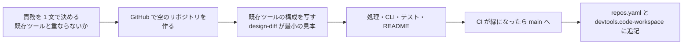

# 新しいツールを追加する

1. **責務を決める**: やること / やらないこと、入力と出力を 1 枚に書く。既存ツールの責務と重なるなら、既存ツールの拡張を先に検討する
2. **リポジトリを作る**: リポジトリ名 = ツール名（ケバブケース）
3. **構成を写す**: 見本は design-diff（小さく、層が分かれている）。次をそろえる
   - `pyproject.toml`: `requires-python = ">=3.12"`、`devtools-common @ git+…@<SHA>`、`[project.scripts]` に CLI、ruff の設定
   - `src/<パッケージ>/`: `cli` は引数と出力だけ、処理は別のモジュール。終了コードは `devtools_common.cli.ExitCode`、レポートは `devtools_common.report`
   - `tests/`: サンプルの入力は `samples/make_samples.py` で生成し、テストもそれを使う（実データを置かない）
   - `setup.sh` / `setup.cmd`（Shift_JIS・CRLF）、`.gitattributes`、`.gitignore`（`.env`・出力・実データ）
   - `.github/workflows/ci.yml`（ruff → pytest → サンプルの実行）、`.github/copilot-instructions.md`、`.github/prompts/<名前>.prompt.md`
   - `README.md`: 何をするか → すぐ使う（3 ステップ）→ 使い方 → 終了コード → 開発
4. **秘密情報**: API キー・トークンは `.env`（`.env.example` に `<your-value>`）。設定ファイルやログに書かない
5. **リポジトリ設定**: `main` のブランチ保護（CI 必須・レビュー必須）
6. **登録**: このリポジトリの `repos.yaml` と `devtools.code-workspace` に追記して PR（テストが両者の一致を検査）
