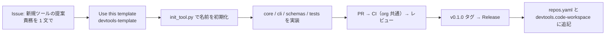

# 新規ツール追加手順（テンプレ複製〜公開）



1. **提案**: 組織の Issue テンプレート「新規ツールの提案」で、責務（やること / やらないこと）と入出力を決める。
   既存ツールの責務と重なるなら、既存ツールの拡張か分割を先に検討する。
2. **作成**: GitHub で `devtools-template` → **Use this template**。リポジトリ名 = ツール名（ケバブケース）。
3. **初期化**:

   ```bash
   cd <親フォルダ>
   git clone https://github.com/shoyo-maya-bot/<tool-name>.git && cd <tool-name>
   python scripts/init_tool.py <tool-name> "<責務を 1 文で>"
   pip install -e ".[dev]" && pytest
   ```

4. **実装**: `core.py`（処理）、`cli.py`（引数と出力）、`schemas/`（設定・入力スキーマ）、`tests/`。
   共通処理は `devtools-common` を使う（足りなければ common 側に PR）。
5. **リポジトリ設定**: `main` のブランチ保護（CI 必須・レビュー必須・直 push 禁止）、CODEOWNERS。
6. **公開**: `pyproject.toml` の version と CHANGELOG を更新 → マージ → `git tag v0.1.0 && git push origin v0.1.0`。
7. **登録**: このリポジトリの `repos.yaml` と `devtools.code-workspace` に追記して PR（テストが両者の一致を検査）。
