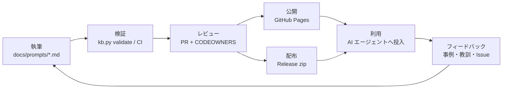

# ai-prompt-kb — 再現プロンプト集（クリーンルーム / 一般ベストプラクティス版）

> **これは特定の勤務先・客先の資産を写したものではありません。**
> 公開情報・OSS・公式ドキュメントで裏取りできる範囲の**一般的なベストプラクティス**から、
> 同種のリポジトリ／ツール／ドキュメント基盤を**新規に**構築するためのプロンプト集です。

AI 活用資産として、プロンプトを **ナレッジとして蓄積（検証・レビュー・版管理）** し、
**ドキュメントサイトと配布パッケージで配る** ためのリポジトリです。



## 使い方（利用者）

1. 空のリポジトリ（または新規フォルダ）を用意する。
2. 目的に合うプロンプトファイルを開き、コードブロックの本文を AI エージェント
   （例: Copilot Agent Mode）へ投入する。
   - 本文だけ取り出す: `python scripts/kb.py extract 01`
3. `{{ }}` プレースホルダを**自社/自分の実態**で埋める。固有名はここに書かない。
4. 生成物を必ず確認・承認してから次のプロンプトへ進む（工程境界で人がレビュー）。

配布 zip（GitHub Releases）には、貼り付け用の本文のみ版（`plain/`）と、
VS Code / GitHub Copilot の再利用プロンプト形式（`copilot/.github/prompts/*.prompt.md`）も同梱しています。

## 収録

<!-- catalog:start -->
| # | ファイル | 対象 | 分類 | 状態 | 版 |
|---|---|---|---|---|---|
| 00 | [00-repo-operations.md](docs/prompts/00-repo-operations.md) | リポジトリ運用・親構成・設計思想（土台） | 土台・リポジトリ運用 | published | 1.0.0 |
| 01 | [01-docs-mkdocs.md](docs/prompts/01-docs-mkdocs.md) | ドキュメント系（MkDocs / Markdown）構成・命名規則（詳細） | ドキュメント基盤・学習資料 | published | 1.0.0 |
| 02 | [02-preview-site.md](docs/prompts/02-preview-site.md) | プレビューサイト（GitHub Actions + GitHub Pages） | ドキュメント基盤・学習資料 | published | 1.0.0 |
| 03 | [03-ai-codegen-framework.md](docs/prompts/03-ai-codegen-framework.md) | AI 駆動コード生成フレームワーク | AI 駆動開発 | published | 1.0.0 |
| 04 | [04-learning-materials.md](docs/prompts/04-learning-materials.md) | 開発者向け学習資料 | ドキュメント基盤・学習資料 | published | 1.0.0 |
| 05 | [05-internal-tools-suite.md](docs/prompts/05-internal-tools-suite.md) | 開発支援ツール集（マルチレポ） | 開発支援ツール | published | 2.0.0 |
| 06 | [06-office-review-tool.md](docs/prompts/06-office-review-tool.md) | Office ドキュメントレビュー（Python） | 開発支援ツール | published | 1.0.0 |
| 07 | [07-slide-tool.md](docs/prompts/07-slide-tool.md) | スライド生成 / 変換ツール | 開発支援ツール | published | 1.0.0 |
| 08 | [08-doc-to-markdown.md](docs/prompts/08-doc-to-markdown.md) | ドキュメント Markdown 化（変換）ツール | 開発支援ツール | published | 2.0.0 |
| 09 | [09-field-validation.md](docs/prompts/09-field-validation.md) | 項目間検証（クロスフィールド検証）ツール | 開発支援ツール | published | 1.0.0 |
<!-- catalog:end -->

推奨順序と依存関係は [docs/prompts/index.md](docs/prompts/index.md) の図を参照してください。

## 原則（重要）

- **固有名を入れない**: 社名・内部パッケージ名・ジョブ ID・内部ライブラリ名・リポ URL 等は
  収録していません。埋めるのは自社の値だけにしてください。
- **「差異なき複製」を目的にしない**: ここにあるのは一般設計のたたき台です。実在資産の逐語コピーではありません。
- **権利・許可の書面は保管**: 持ち出し・再利用の可否は所属先の規程と契約に従ってください。
- **機密を書かない**: `.env` はコミットしない。秘密情報はコード・ドキュメントに直書きしない
  （テンプレートは `<your-value>` のようにする）。

これらは `kb.config.yaml` の禁止パターンと CI で機械的にも検査します（詳細: [docs/guides/principles.md](docs/guides/principles.md)）。

## リポジトリ構成

```text
ai-prompt-kb/
├── docs/                       # MkDocs の docs_dir（= 公開サイト）
│   ├── index.md                # トップ
│   ├── prompts/                # ★ プロンプト本体（1 プロンプト = 1 ファイル, NN-kebab-case.md）
│   │   └── index.md            #   収録表・依存図（自動生成）
│   ├── guides/                 # 使い方・原則・執筆ガイド・ライフサイクル
│   ├── knowledge/              # 活用ナレッジ（事例 cases/・教訓 lessons/）
│   ├── templates/              # 新規プロンプト / 事例 / 教訓の雛形（サイトには出さない）
│   ├── includes/               # 共通スニペット（略語表）
│   └── stylesheets/
├── scripts/kb.py               # 検証・カタログ生成・新規作成・本文抽出・配布パッケージ作成
├── tests/                      # kb.py のテスト（標準ライブラリ unittest）
├── kb.config.yaml              # ルール定義（必須項目・分類・禁止パターン）= SSOT
├── VERSION                     # 配布パッケージの版（SemVer）
├── CHANGELOG.md
├── mkdocs.yml / requirements.txt
├── .markdownlint.jsonc / .textlintrc.json / package.json
├── .github/                    # CI（検証）・Pages 公開・Release 配布・PR/Issue テンプレート
├── CONTRIBUTING.md / RULES.md / WORKFLOW.md
└── README.md
```

## 開発者向け（管理者・執筆者）

```bash
python -m venv .venv
# Windows: .venv\Scripts\activate / macOS・Linux: source .venv/bin/activate
pip install -r requirements.txt

python scripts/kb.py validate             # 全体検証（CI と同じ）
python scripts/kb.py catalog              # 収録表（README / docs/prompts/index.md）を再生成
python scripts/kb.py new 09 api-diff-tool "API 差分抽出ツール" --category tools
python scripts/kb.py dist                 # dist/ai-prompt-kb-<VERSION>.zip を作成
python -m unittest discover -s tests      # テスト

mkdocs serve                              # http://127.0.0.1:8000 でプレビュー
mkdocs build --strict                     # CI と同じ厳格ビルド

npm install && npm run lint               # markdownlint + textlint（任意・CI では実行）
```

追加・更新の流れは [WORKFLOW.md](WORKFLOW.md)、書き方は [RULES.md](RULES.md) と
[CONTRIBUTING.md](CONTRIBUTING.md) を参照してください。

## 公開・配布

| 経路 | トリガ | 内容 |
|---|---|---|
| ドキュメントサイト | `main` へのマージ | `.github/workflows/docs-deploy.yml` が GitHub Pages へ公開 |
| 配布パッケージ | `v*` タグの push（`VERSION` と一致必須） | `.github/workflows/release.yml` が zip を GitHub Release に添付 |

### GitHub Pages の初回設定

1. リポジトリの **Settings → Pages → Build and deployment → Source** を **GitHub Actions** にする。
2. `mkdocs.yml` の `site_url` / `repo_url` を自分のリポジトリに合わせる。
3. **Settings → Branches** で `main` にブランチ保護を設定し、必須チェックに `validate` と `docs-build` を指定する。
4. 独自ドメインを使う場合は `docs/CNAME` にドメインを 1 行で書き、DNS に CNAME を設定する（任意）。

### リリース手順

```bash
# 1. VERSION と CHANGELOG.md を更新して PR → マージ
# 2. タグを打って push
git tag v1.0.0 && git push origin v1.0.0
```

## ライセンス

利用・再配布の条件は所属組織の方針に合わせて `LICENSE` を追加してください（未設定の間は組織内利用に限定）。
