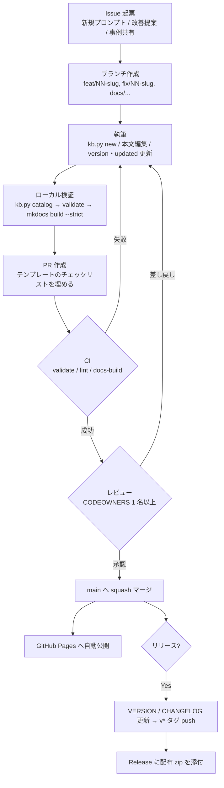

# WORKFLOW — 起票から公開・配布まで

## ブランチとコミット

- `main` は保護ブランチ（直 push 禁止・必須チェック・レビュー必須）。
- ブランチ名: `feat/<NN>-<slug>`（追加）、`fix/<NN>-<slug>`（修正）、`docs/<topic>`（ガイド・ナレッジ）、`chore/<topic>`（基盤）。
- コミットは [Conventional Commits](https://www.conventionalcommits.org/ja/v1.0.0/) に従う。
  例: `feat(prompts): add 09 api-diff-tool` / `fix(03): clarify quality gates`

## レビュー観点

| 観点 | 確認内容 |
|---|---|
| 原則 | 固有名・機密がない。一般手法で書かれている。実在資産の逐語コピーでない |
| 正確性 | 手法・ツール名・設定値が公開情報で裏取りできる |
| 網羅性 | `# 出力` を見れば完了条件がわかる。品質基準が含まれる |
| 再利用性 | 変わりうる値が `{{ }}` に出ている。前提を埋めれば他チームでも使える |
| 表記 | [RULES.md](RULES.md) に準拠 |
| 版 | `version` の上げ方が [ライフサイクル](docs/guides/lifecycle.md) に沿っている。`updated` 更新済み |
| リンク | 収録表・nav が更新され、`mkdocs build --strict` が通る |
