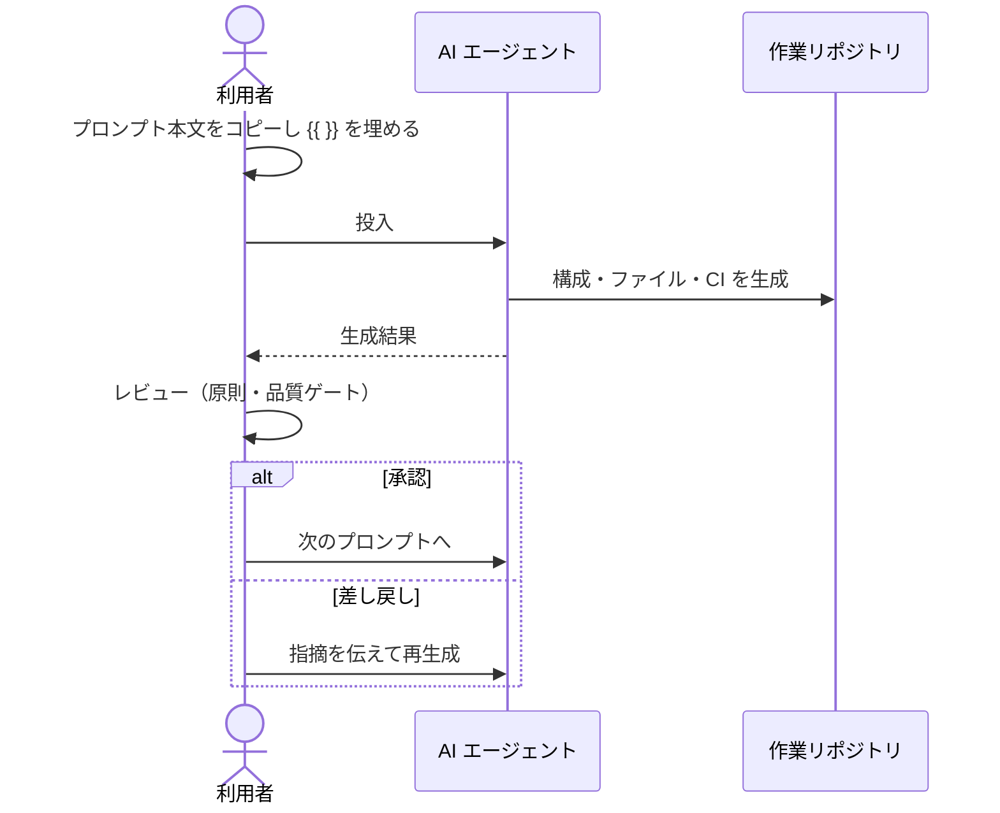

# 使い方

## 基本の 4 ステップ

1. 空のリポジトリ（または新規フォルダ）を用意する。
2. 目的に合うプロンプトファイルを開き、コードブロックの本文を AI エージェント
   （例: Copilot Agent Mode）へ投入する。
3. `{{ }}` プレースホルダを**自社/自分の実態**で埋める。固有名はプロンプト集側に書かない。
4. 生成物を必ず確認・承認してから次のプロンプトへ進む（工程境界で人がレビュー）。

## 本文の取り出し方

| 方法 | 手順 |
|---|---|
| サイトから | コードブロック右上のコピーボタン |
| CLI | `python scripts/kb.py extract 03` を実行し、出力をコピー |
| 配布 zip | `plain/NN-*.txt` を開いてコピー |
| Copilot 再利用プロンプト | zip の `copilot/.github/prompts/*.prompt.md` を作業リポの `.github/prompts/` に置き、Copilot Chat から呼び出す |

## プレースホルダの埋め方

- `{{例: A / B}}` は選択肢の例示です。自分の状況に合わせて書き換え、`{{ }}` 自体は消します。
- 固有名（社名・内部システム名）は**投入時の手元でだけ**埋め、このリポジトリには書き戻さないでください。
- 迷ったら空欄で投入せず「未定。一般的な選択肢と判断基準も提示して」と書くと、汎用論に流れにくくなります。

## 推奨順序

[プロンプト一覧](../prompts/index.md) の依存関係図を参照してください。
`00`（土台）を先に決めると、後続プロンプトの前提（言語・CI・構成方針）が揃います。

## 使ったら

うまくいった点・つまずいた点を [活用ナレッジ](../knowledge/index.md) に残してください。
プロンプト本文を直したほうがよい場合は Issue「プロンプト改善提案」を起票します。
