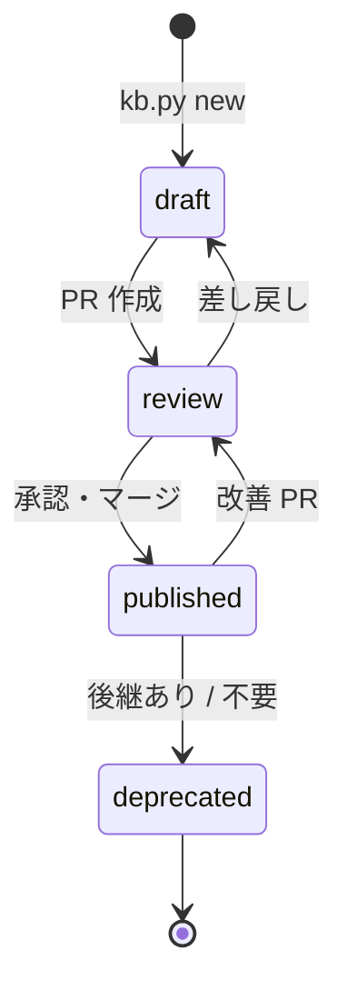
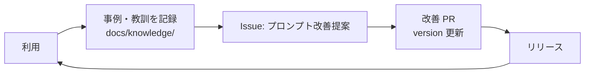

# ライフサイクル

## 状態遷移

| status | サイト表示 | 配布 zip | 意味 |
|---|---|---|---|
| `draft` | ○ | × | 執筆中 |
| `review` | ○ | × | レビュー中 |
| `published` | ○ | ○ | 利用推奨 |
| `deprecated` | ○ | × | 非推奨。本文冒頭に後継を明記する |

## 版管理

### プロンプト単位（front matter の `version`）

| 変更内容 | 上げる桁 | 例 |
|---|---|---|
| 前提・出力の構造が変わる（利用者の埋め方が変わる） | MAJOR | 1.2.0 → 2.0.0 |
| 設計項目・品質ゲートの追加 | MINOR | 1.2.0 → 1.3.0 |
| 誤字・言い回しの修正 | PATCH | 1.2.0 → 1.2.1 |

変更したら `updated` も更新します。

### 配布パッケージ単位（ルートの `VERSION`）

- リリースごとに `VERSION` と `CHANGELOG.md` を更新し、`v<VERSION>` タグを push します。
- タグと `VERSION` が一致しないとリリースワークフローは失敗します。

## ナレッジの循環

