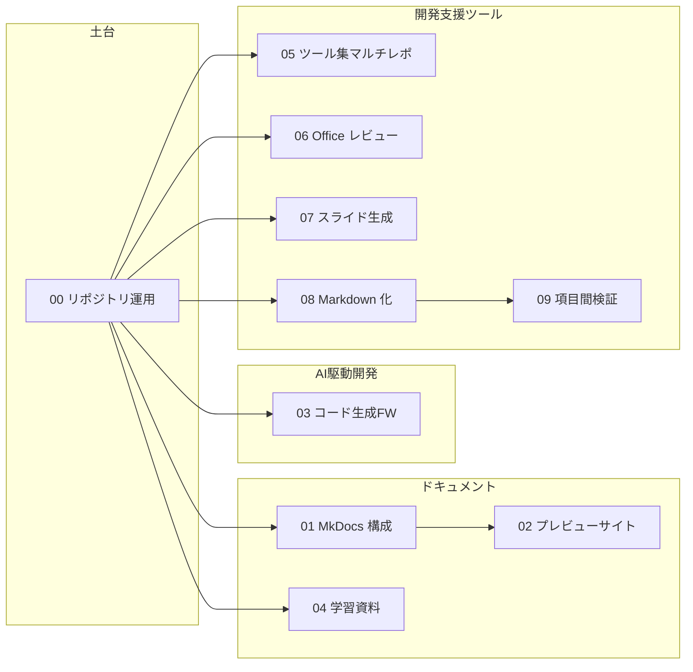

# AI 活用プロンプト集

!!! note "クリーンルーム版"
    これは特定の勤務先・客先の資産を写したものではありません。
    公開情報・OSS・公式ドキュメントで裏取りできる範囲の**一般的なベストプラクティス**から、
    同種のリポジトリ／ツール／ドキュメント基盤を**新規に**構築するためのプロンプト集です。

## はじめに

- :material-rocket-launch: **[使い方](guides/how-to-use.md)**

    プロンプトを AI エージェントに投入し、工程境界でレビューしながら進める手順

- :material-format-list-numbered: **[プロンプト一覧](prompts/index.md)**

    収録 10 本と推奨順序（依存関係図）

- :material-shield-check: **[原則](guides/principles.md)**

    固有名・機密を入れない、複製を目的にしない

- :material-lightbulb-on: **[活用ナレッジ](knowledge/index.md)**

    使ってみた事例と教訓を蓄積する場所

## 全体像

## 貢献する

プロンプトの改善・追加や活用事例の共有は、[執筆ガイド](guides/writing-prompts.md) と
[ライフサイクル](guides/lifecycle.md) を参照してください。
