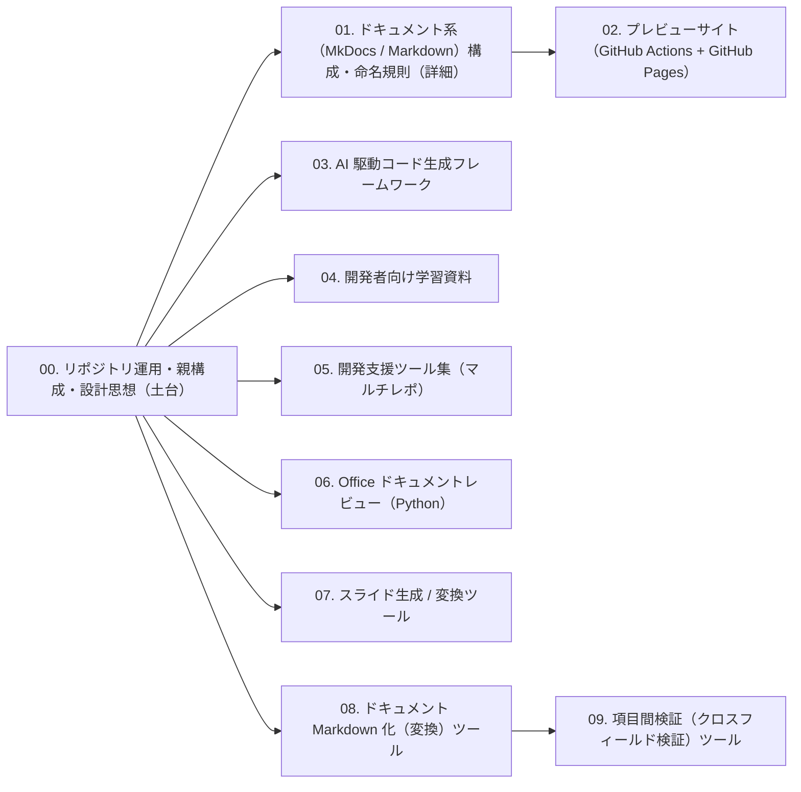

<!-- このファイルは scripts/kb.py catalog で自動生成されます。手で編集しないでください。 -->

# プロンプト一覧

各プロンプトの **コードブロックの本文** を AI エージェントに投入し、`{{ }}` を自分の実態で埋めて使います。
使い方の詳細は [使い方](../guides/how-to-use.md) を参照してください。

## 収録

| # | ファイル | 対象 | 分類 | 状態 | 版 |
|---|---|---|---|---|---|
| 00 | [00-repo-operations.md](00-repo-operations.md) | リポジトリ運用・親構成・設計思想（土台） | 土台・リポジトリ運用 | published | 1.0.0 |
| 01 | [01-docs-mkdocs.md](01-docs-mkdocs.md) | ドキュメント系（MkDocs / Markdown）構成・命名規則（詳細） | ドキュメント基盤・学習資料 | published | 1.0.0 |
| 02 | [02-preview-site.md](02-preview-site.md) | プレビューサイト（GitHub Actions + GitHub Pages） | ドキュメント基盤・学習資料 | published | 1.0.0 |
| 03 | [03-ai-codegen-framework.md](03-ai-codegen-framework.md) | AI 駆動コード生成フレームワーク | AI 駆動開発 | published | 1.0.0 |
| 04 | [04-learning-materials.md](04-learning-materials.md) | 開発者向け学習資料 | ドキュメント基盤・学習資料 | published | 1.0.0 |
| 05 | [05-internal-tools-suite.md](05-internal-tools-suite.md) | 開発支援ツール集（マルチレポ） | 開発支援ツール | published | 2.0.0 |
| 06 | [06-office-review-tool.md](06-office-review-tool.md) | Office ドキュメントレビュー（Python） | 開発支援ツール | published | 1.0.0 |
| 07 | [07-slide-tool.md](07-slide-tool.md) | スライド生成 / 変換ツール | 開発支援ツール | published | 1.0.0 |
| 08 | [08-doc-to-markdown.md](08-doc-to-markdown.md) | ドキュメント Markdown 化（変換）ツール | 開発支援ツール | published | 2.0.0 |
| 09 | [09-field-validation.md](09-field-validation.md) | 項目間検証（クロスフィールド検証）ツール | 開発支援ツール | published | 1.0.0 |

## 推奨順序（依存関係）

矢印の元を先に実施すると、後続プロンプトの前提が揃います。

